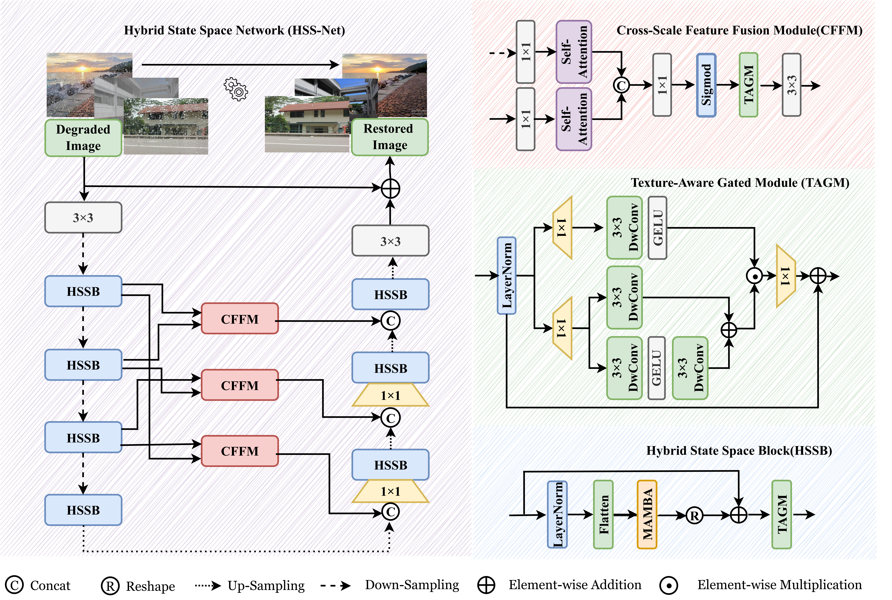
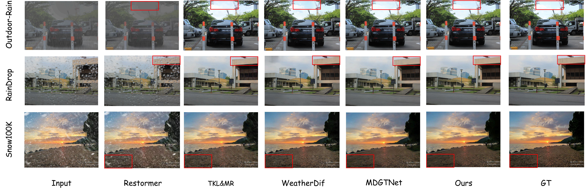

<div align="center">

<h1>🌩️ HSS-Net: Hybrid State Space Modeling for Efficient Unified Adverse Weather Restoration</h1>

**Official PyTorch Implementation of HSS-Net** <br>
🎉 **Accepted at ICMR 2026** 🎉

[](https://pytorch.org/)
[](https://www.python.org/)
[](http://creativecommons.org/licenses/by-nc-nd/4.0/)

</div>

---

## 📖 Overview

<div align="center">
  
</div>
<br>

> Adverse weather (e.g., rain, snow, and haze) degrades visual content and undermines downstream multimedia retrieval and object recognition. 

To bridge the gap between restoration quality and system efficiency, we propose the **Hybrid State Space Network (HSS-Net)**, an efficient preprocessing solution tailored for multimedia understanding systems. 

HSS-Net achieves an optimal balance between high-fidelity texture recovery and low-latency responsiveness via:

* 🚀 **Hybrid State Space Block (HSSB):** Integrates Mamba-based State Space Models (SSMs) to model long-range degradation contexts with linear complexity.
* 🔍 **Texture-Aware Gated Module (TAGM):** A parallel branch for precise local texture recovery.
* 🧩 **Cross-Scale Feature Fusion Module (CFFM):** Dynamically filters and aggregates features from different resolutions to suppress weather noise propagation.

---

## ✨ Visual Results

<div align="center">
  
</div>

HSS-Net demonstrates superior visual quality and robustness across various adverse weather conditions (Rain, Snow, Haze), accurately restoring semantic details without introducing artifacts, and significantly boosting downstream object detection accuracy.

---

## ⚙️ Requirements

The code has been tested with **Python 3.10** and **PyTorch 2.0.1**. 

Please install the required dependencies:

```bash
# Install basic requirements
pip install -r requirements.txt

# Ensure `mamba_ssm` is properly installed for your specific CUDA version
pip install mamba-ssm
```

---

## 📂 Dataset Preparation

To reproduce the paper's results, please download the **AllWeather** training set and the corresponding synthetic evaluation datasets from the following official links:

* 📥 **[AllWeather (Training)](https://drive.google.com/file/d/1tfeBnjZX1wIhIFPl6HOzzOKOyo0GdGHl/view)**
* 📥 **[Outdoor-Rain (Evaluation)](https://www.dropbox.com/scl/fo/3c7wutxxmnvd4pwyiwvk8/AM3FAJcvKImc-rgaRUBhr5Q?rlkey=16vbvckaeg9wwk20fww8s9ubd&dl=0)**
* 📥 **[RainDrop (Evaluation)](https://drive.google.com/drive/folders/1e7R76s6vwUJxILOcAsthgDLPSnOrQ49K)**
* 📥 **[Snow100K (Evaluation)](https://sites.google.com/view/yunfuliu/desnownet)**

After downloading, organize the directory structure strictly as follows:

```text
datasets/
    ├── Allweather/        # For Training
    │   ├── train/
    │   │   ├── input/     # Degraded images
    │   │   └── gt/        # Clean images
    │   └── val/
    ├── RainDrop/          # For Evaluation
    │   ├── input/
    │   └── gt/
    ├── Outdoor_Rain/      # For Evaluation
    ├── Snow100K/          # For Evaluation
    └── ...
```

> ⚠️ **Note:** Please make sure that the `dataset_dir` path in your configuration file (`configs/allweather.yaml`) points correctly to the Allweather dataset directory. By default, it has been configured as a relative path `./datasets/Allweather`.

---

## 🚀 Training

We support single-GPU training by default. To train the HSS-Net on the AllWeather dataset, run:

```bash
CUDA_VISIBLE_DEVICES=0 python train.py --cfg=allweather.yaml --exp=exp_allweather
```

### 🛠️ Full Training Arguments (`train.py`)
* `--cfg`: **(Required)** The configuration file name (e.g., `allweather.yaml`).
* `--exp`: Path for saving running related data and checkpoints (default: `exp`).
* `--doc`: A string for documentation purposes. Will be the name of the log folder (default: `doc`).
* `--resume`: Path to the checkpoint file to resume training from a specific `.pth`.
* `--seed`: Random seed for reproducibility (default: `1234`).
* `--val_folder`: Folder name for verification results (default: `val_image`).
* `--device`: Specify the device to run the model (e.g., `cuda` or `cpu`).
* `--parallel`: Flag to use `DataParallel` computing mode for multi-GPU setups.
* `--no_patch`: Flag to disable patching methods during testing/validation.

---

## 🧪 Evaluation & Testing

To reproduce the experimental results reported in Table 1 of our paper, you can evaluate the trained model on specific test sets using `test.py`. 

**Example: Evaluating on the RainDrop dataset**
```bash
CUDA_VISIBLE_DEVICES=0 python test.py \
    --cfg=allweather.yaml \
    --resume=exp/ckpts/Allweather240000.pth \
    --sample_set=datasets/RainDrop \
    --sample_folder=exp/results/RainDrop \
    --calc_in_Y
```

### 🛠️ Full Testing Arguments (`test.py`)
* `--cfg`: **(Required)** Configuration file used during training.
* `--resume`: **(Required)** Path to the pre-trained model checkpoint (`.pth`).
* `--sample_set`: Directory path of the specific test dataset (e.g., `datasets/Outdoor_Rain`).
* `--sample_folder`: Directory where the restored images will be saved.
* `--calc_in_Y`: Important flag for standardized evaluation. Calculates PSNR/SSIM exclusively on the Y (luminance) channel of the YCbCr color space, following standard image restoration protocols.

### Reproducing Paper Benchmarks:
You can sequentially evaluate all benchmarks used in the paper (RainDrop-A, Outdoor-Rain, Snow100K) by altering the `--sample_set` and `--sample_folder` arguments. 

*(You can also test generalization on real-world datasets like UAV-Rain1k or RICE using the exact same format).*

---

## 📝 Citation

If you find our work useful in your research, please consider citing our paper:

```bibtex
@inproceedings{zhu2026hssnet,
  title={HSS-Net: Hybrid State Space Modeling for Efficient Unified Adverse Weather Restoration},
  author={Zhu, Yueqi and Zhang, Baiwen and Cheng, Guo and Zhang, Yongkang and Liu, Feiran and Cao, Er and Xu, Meng},
  booktitle={International Conference on Multimedia Retrieval (ICMR)},
  year={2026}
}
```